# ÇEVİRİ UYGULAMASI

Bu projemizde https://mymemory.translated.net/doc/spec.php* sitesinden Apı alarak bir çeviri uygulaması yaptık. Bu uygulamayı oluştururuken boostrap kütüphanesinden yararlandık. 

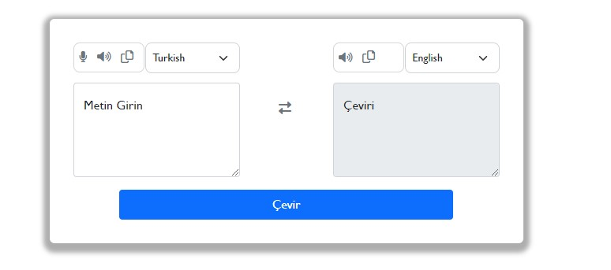

Translater alanın sağ tarafında çeviri yapmak istediğimiz ülkenin bilgisini ve yazacağımız metni, metin  giriş alanına yazıyoruz. Sol tarafında ise girdiğimiz metni çevirmek istedimiz dili seçip  alttaki  çevir butonuna tıklıyoruz. Çevir butonuna tıkladığımızda çeviriniz sol taraftaki metin alanına aktarılacak. Sol tarafta ise girdiğimiz metni hangi dile çevirmek istiyorsak onu seçiyoruz. Bu metin alanına dışardan bir bilgi giremiyoruz sağ tarafta girdiğimiz metnin çevirisi bu alanda kullanıcıya gösterilecek.


- Yukarıdaki resimde kırmızı dikdörtgen içerisinde yer alan icona tıkladığımızda dillerin yerleri değişecek.
- Yeşil dikdörtgen içinde mikrofon ikonuna tıkladığımızda klavye kullanmadan sadece mikrofona konuşarak çevirmek istediğimiz metni söylüyoruz. Ses ikonun tıkladığımızda metin alanına girdiğimiz kelimeyi veya cümleyi okuyor. Kopyala ikonuna tıkladığımızda ise  metin alanındaki kelimeyi veya cümleyi kopyalayıp başka biryere yapıştırabiliyoruz.
- Mavi diktörgen içindeki ses ikonuna tıkladığımızda girdiğimiz metni çevirdiğimiz dilde bize okuyor. Kopyala ikonuna tıkladığımız da ise çevirilen kelime veya cümleyi kopyalayabliyorsunuz.
- Mavi ve yeşil dikdörtgenlerin yanında ise bulunan seçenek kutusu üstüne tıkladığımızda ise çeviri yapmak istediğinzi ülkeler gelmektedir..

| 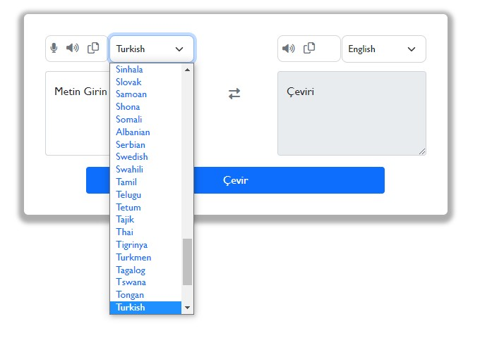 | 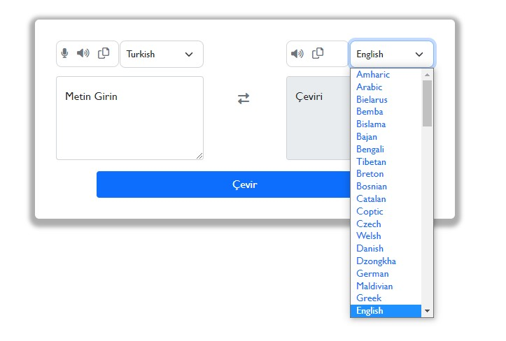 |
| ---------------------- | ---------------------- |

## Çeviri Uygulaması Tasarımı;

Çeviri tasarımımızı yaparken body etiketi içinde position,align-items,justify-content classlarını kullanarak oluşturacağımız tasarımımız sayfanın ortasında gösterilecek..

```css
*{
    margin: 0;
    padding: 0;
    box-sizing: 0;
    font-family: 'Gill Sans', 'Gill Sans MT', Calibri, 'Trebuchet MS', sans-serif;
}

.body{
    position: absolute;
    align-items: center;
    justify-content: center;
    height: 50vh;
    top: 50px;
    background-color: rgb(176, 162, 162);
}
```

Çeviri alanımızı container içinde tasarlıyoruz. Containerımızın genişiliğini 600px olarak ayarlıyoruz. Kenarları için border: 1px solid rgba(0, 0, 0, 0.16); classını kullanarak tasarımmızı sanki kart içinde yapıyormuşuz gibi gösteriyoruz. 

```css
.container{
    margin-top: 50px;
padding: 30px;
width: 600px;

border: 1px solid rgba(0, 0, 0, 0.16);
border: none;
outline: none;
border-radius: 6px;
box-shadow: 0px 4px 6px 8px rgba(0, 0, 0, 0.32);

}
```

Container içinde row classı altında 3 tane colon  oluşturuyoruz. Bu colonları col-5,col-2,col-5 olarak ayırıyoruz. İlk col-5 *(siyah dikdörgen içinde gösterielen alan)* kolonu içinde bir tane col-4 kolonu oluşturuyoruz.Col-4 kolonunda celarfix css sınıfı oluşturarak col-4 içinde oluşturacağımız kolonların kendi  içinde konumlarımızı ayarlamış olacağız. Col-4 kolonu içinde col-1 kolonu *(kırmızı dikdörtgen içinde gösterilen alan)*  ve col-3 *(mavi dikdörtgen içinde gösterilen alan)*  kolonlarını  oluşturuyoruz. Col-1 kolonu içinde benim mikrofon ikonum, ses ikonum ve kopyala ikonum yer almaktadır. Col-1 kolonunu tasarımında icon classı içinde  alanın genişliğini 90px, paddingini 6px ve  border: 1px solid  rgba(0, 0, 0, 0.16); kutu içinde gösterdiyoruz. 

```css
.icon {
    border: 1px solid rgba(0, 0, 0, 0.16);
    padding: 6px;
    border-radius: 8px;
    width: 90px;
}
.opt {
    border-radius: 8px;
    padding: 8px;
    width: 120px;
    cursor: pointer;
}
```

Col-3 kolonu içinde de select etiketi altın da bir tane form-select classı oluşturuyoruz. Bu select üzerine tıkladığımızda ülke seçebileceğiz. Col-3 kolonunu da opt classı içinde  genişiğini 12px olarak ayarlıyoruz. 

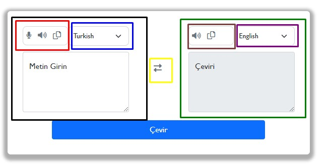

Bu col-4 yapısı içinden çıkıp col-5 kolonu içinde metin girin alanını textarea tagıiçinde form-text ve form-control classını kullanarak oluşturuyoruz. 

Col-5 alanını (siyah dikdörtgen içindeki alanı) tasarladıktan sonra col-5 kolonun hemen altında col-2 kolonu açarak(sarı renk içinde gösterilen alan) içinde <i class=fa-solid fa-right-left></i> iconu tanımlıyoruz. Bu ikona tıkladığımızda diller karşılıklı olarak değişecek.

Col-2 alanının tasarımızı yaptıktan sonra col-2 kolonunun hemen altında col-5 (yeşil dikdörtgen içinde gösterilen alan) colonu oluşturuyıruz. Bu kolonun da kendi içinde colonlar oluşturuyoruz. Col-4 colonu içinde col-1 (kahverengi dikdörtgen içinde gösterilen alan) ve col-3 (mor dikdörgen içinde gösterilen alan) kolonu olluşturuyoruz. Önceki col-5 içinde uyguladığımız css kodlarının aynısını burzdaki colon içinde de uyguluyoruz. Bu kolon içindeki textarea etiketini oluştururken **disabled, readonly** özelliklerini ekledik bu textarea içine herhangi bir bilgi yazamayacağız sadece sağ alandaki metin girin alanında oluşturduğumuz çeviri buraya aktarılacak.

Kolonlar içnde tasarımlarımızı yaptıktan sonra row classı içinde col kullanmadan bir tane buton tanımlıyoruz. Bu butona tıkladığımızda bize çeviri sonucu sol taraftataki textarea içinde gösterilecek. Butonumu tasarlarken rengine btn-primary özelliğini veriyoruz,  butonun genişiğini 75% olarak ayarlıyoruz.  

```html
 <button class="btn btn-primary w-75 mt-3 " id="btnTranslate">Çevir</button>
```

## Çeviri Uygulaması Javascript Kodları;

Jvascript kodlarımızı yazmaya başlamadan önce tasarım alanında tasarımımızı oluştururken oluşturduğumuz elemanların herbirinin ıd ve claas bilgilerini alıp ilgili değişkenlere atıyoruz.

```javascript
const fromLang = document.getElementById("fromLang");
const toLang = document.getElementById("toLang")
const fromText = document.getElementById("from-text")
const toText = document.getElementById("to-text")
const btnTranslate = document.getElementById("btnTranslate")
const ıcon = document.getElementById("icon")
const icons = document.querySelectorAll(".icon")
```

Javascript alanımızdaa languages diye bir nesne oluşturuyourz. Bu nesne içinde ülkelelerin başlık kısaltmaları ve ülke adları yer almaktadır.

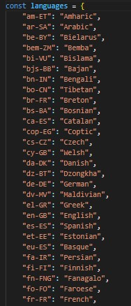

```javascript
for(let lang in languages){
    console.log(lang, languages[lang])

    let options = ` <option class="text-primary opt"  value=${lang}>${languages[lang]} </option>`

    fromLang.insertAdjacentHTML("beforeend",options);
    toLang.insertAdjacentHTML("beforeend",options)

    fromLang.value= "tr-TR";
    toLang.value= "en-GB"
}
```

Languages içindeki verilere ulaşabilmek için  for in döngüsü kullanıyoruz. For in dögüsü il nesneyi lang içine atıyoruz.  console.log(lang, languages[lang]) lang ile biz ülkenin kısaltılmış kodları geliyor, languages[lang] ilede ülkenin adı geliyor. 

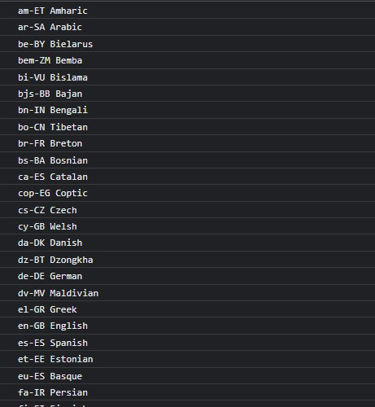

Options diye bir değişken tanımlıyoruz. Bu değişken içerisne option etiketi içinde bir seçenek şisteesi oluşturuyoruz. <option class="text-primary opt"  value=${lang}>${languages[lang]} </option>  Oluşturduğumuz bu seçenek listelerini section içerisine atıyoruz. 

```javascript

          <div class="col-3 ms-5 mb-1">
            <select class="form-select form-select-sm opt" id="fromLang"></select>
          </div>
          const fromLang = document.getElementById("fromLang");
           fromLang.insertAdjacentHTML("beforeend",options);

```

Yukarıdaki kodlarda ilk önce sol taraftaki alan içine attık. Bu alan çeviri yapacağımız metinin bulunduğu alan.

```javascript
 <div class="col-3 ms-5 mb-1">
            <select class="form-select form-select-sm opt" id="toLang">
            </select>
    </div>
     const toLang = document.getElementById("toLang")
     toLang.insertAdjacentHTML("beforeend",options)
     
```

Yukarıdaki kodlarda sağ taraftaki alanı yani çeviri yapılacak dilin olduğu alan.

Sayfa yüklendiğinde varsayılan olarak select kutuları içine    fromLang.value= "tr-TR"; toLang.value= "en-GB" değerlerini atadık..

```javascript
 <button class="btn btn-primary w-75 mt-3 " id="btnTranslate">Çevir</button>
 const btnTranslate = document.getElementById("btnTranslate")
```

Çevir butumuza click olayı ekledik. Kullancı bu butona tıkladığında çeviri işlemi gerçekleşecek. 

```javascript
          <textarea class="form-control from-text" placeholder="Metin Girin" id="from-text"
            style="height: 120px"></textarea>
            const fromText = document.getElementById("from-text")
             const text = fromText.value;
```

from-text id'sine sahip olan textarea içine girilen değeri aliıp text değişkeni içerisine atıyoruz. fromLang id'sine sahip select içinde seçilen olan değeri alıp from değişşkeni içerisine atıyoruz. toLang id'sine sahip olan select'in değerini de to değişkeni içerisine atıyoruz. Url diye bir değişken oluşuruyoruz bu değiken içerisine MyMemory  sitesinden aldığımız apı bilgisini yazıyoruz.

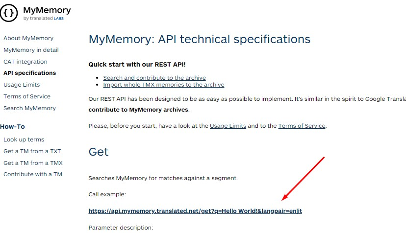

```javascript
const url = `https://api.mymemory.translated.net/get?q=${text}!&langpair=${from}|${to}`

```

url içine kendi oluşturduğumuz text ve select alanından seçtiğimiz fromLang ve toLang değerleini de url içerisine yerleştiriyoruz.

- showTranslate adında async-await fonksiyonu oluşturduk. response değişkeni içerisinde url'yi fetch ettik. Aşağıdaki resimde yeşil okla gösterilen bizim çevirmek istediğimiz kelime, kırmızı okla gösterilen alan fromLang alanı çevridiğimiz dil, mavi okla gösterilen alan dile çevirilecek olan alan..

  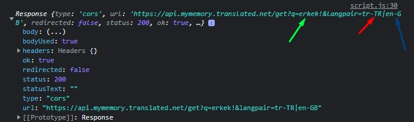

- response içerisindeki değeri json veriye çevirip data değişkeni içersine atıyoruz. Data içerisinden elde ettiğimiz veriyide toText.value değişkeni içerisine atıyoruz. 

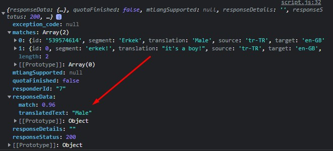

Col-2 içinde oluşturduğumuz ikona click eventi veriyoruz bu icona tıkladığımızda dillerin yerleri değişecek. fromText.value içerisindeki veriyi alıp changeFromText değişkeni içerisne atıyoruz. toText.value içerisndeki değeri de fromText.value içerisine atıyoruz, toText.value değişkeni içerisine de changeFromtext değerini atıyoruz bu işlem sonucunda textarea içindeki değerlerin yerleri değişmiş olacak. Aynı işlemi diller içinde yapıyoruz. changeFromLang değişkeni içerisine fromLang.value değerini atıyoruz. toText.value değerinide fromText.value değişkeni içerisine atıyoruz.toText.value içinede changeFromLang değişkenini atıyoruz böyleliklede dillerin yerlerinide değiştimiş oluyoruz.

```javascript
const ıcon = document.getElementById("icon")

    ıcon.addEventListener("click", () =>{
       
     const changeFromText = fromText.value;
     fromText.value = toText.value;
     toText.value = changeFromText

   const changeFromLang = fromLang.value
     fromLang.value=toLang.value;
     toLang.value = changeFromLang;

    })
```

| 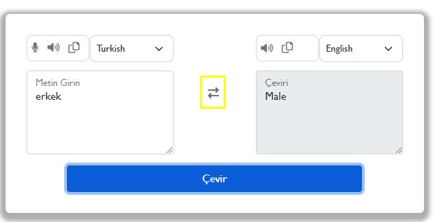 | 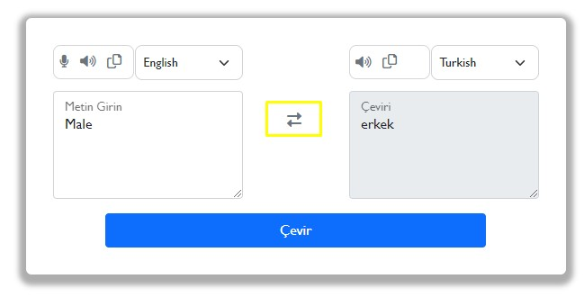 |
| ------------------------ | ------------------------ |

Soldaki resimde ikona tıklanmadan önceki halini görüyorsunuz. Sağdaki resimde ise ikona tıkladındıktan sonraki halini. Select ve textarea içindeki değerlerin yerleri değişmiş bir şekilde.

```html
  <div class="icon mb-1  me-5 col-1 d-inline-block ">

            <i id="from" class="fa-solid fa-microphone fa-sm text-muted me-2"></i>
            <i id="from" class="fa-solid fa-volume-high fa-sm text-muted"></i>
            <i id="from" class="fa-regular fa-copy text-muted ms-2"></i>

    </div>
    
      <div class="icon mb-1 me-3 col-1 d-inline-block"> 
            <i id="to" class="fa-solid fa-volume-high fa-sm text-muted"></i>
            <i id="to" class="fa-regular fa-copy text-muted ms-2"></i>
       </div>
    
const icons = document.querySelectorAll(".icon")
```

Uygulamam da kullandığım mikrofon, ses, kopyala ikonlarını icon classı altında quersySellectorAll ile alıp bunları icons değişkeni içerisine attım.  İcons for of döngüsü kullanarak ıconArea içine ıconArea ile bütün ikonlara click olayı ekliyoruz.

```javascript
 for(let ıconArea of icons){
        ıconArea.addEventListener("click", (element)=>{
            console.log(ıconArea)
    const text = fromText.value;
    const from = fromLang.value;
    const to = toLang.value;
```


Kırmızı dikdörtgen içerisindeki alan bizi fromLang alanında olan ikonlarımız bu ikonlardan herhangi birine tıkladığımızda from alanı çalışacak. Mavi diktdörtgen içerisindeki alanda toLang alanımız burda herhangi bir ikona tıkladığımızda to alanı çalışacak.

```javascript
if(element.target.classList.contains("fa-copy")){
                if(element.target.id == "from"){
                  navigator.clipboard.writeText(fromText.value)
                }else{
                    navigator.clipboard.writeText(toText.value)
                }
```

Yukarıdaki kodda üzerine tıkladığımızda eleman fa-copy classında sahip ise ve bu elemanın id'si from ise fromText içerisindeki metini navigator.clipboard.writeText özelliği ile kopyalayabileceğiz fa-copy classı from içindeki kopyala ikonuna değilde to içerisindeki kopyala ikonuna tıkladığımızda bana toText içerisndeki değeri kopyalayacak.

```javascript
}else if(element.target.classList.contains("fa-microphone")){    
                if(element.target.id == "from"){
                    const SpeechRecognition = window.SpeechRecognition || window.webkitSpeechRecognition;
                    const recognition = new SpeechRecognition();
                    recognition.interimResults = true;
               
                 recognition.addEventListener("result", (e)=>{

                    const text = Array.from(e.results)
                    .map(result => result[0])
                    .map(result => result.transcript)
                    .join("");

                    fromText.innerText = text
                    console.log(text)

                    console.log(e)
                    
                 })

```

Üzerine tıkladığımız icon microphone ikonu ise ve bu ikon from içerisinde is değeri fromText içine yazacak. Biz mikrofon ikonuna tıkladığımızda bize ekranda bir bildirim mesajı gelecek bu bildirim mesajında mikrofonunuzu kulanma izni çıkacak evet'e tıklarsanız mikrofonunuz söylediğiniz herşey fromText içerisine kayıtedecektir.Bu işem yapmak için windowSpeechRecognition  özelliğni kullanıyoruz bu özeliği Web Speech Apı üzerinden aldık. recognition değişkenine result olayı ekliyoruz bize metin fromText alanına  girilen değeri dönderecek.


Resultın 0 indeksindeki değeri al. 0. indesksteki transcript bilgisini al text değişkeni içerisine at tetx değişkeninide fromText içine at.. Kırmızı okla gösterilen alan bizim mikrofona konuştuğumuz cümle. 

```javascript

                 recognition.addEventListener("result", (e)=>{

                    const text = Array.from(e.results)
                    .map(result => result[0])
                    .map(result => result.transcript)
                    .join("");

```

recognition.start() ile de kayıtı başlatmış oluyoruz.

```javascript
  let utterance
                if(element.target.id == "from"){
                    utterance = new SpeechSynthesisUtterance(fromText.value)
                    utterance.lang = fromLang.value
                }else{
                    utterance = new SpeechSynthesisUtterance(toText.value)
                    utterance.lang = toLang.value
                }

                speechSynthesis.speak(utterance)
```

Yukarıdaki kod da from alanındaki ses  ikonuna tıklarsak bize fromText içierisindeki değeri okuyacak. Eğer to alanındaki ses ikonuna tıklarsak toText içerisindeki değrei okuyacak. **speechSynthesis.speak** Web apısini kullanıyoruz bu apiyle birlikte SpeechSynthesisUtterance() parantez içine okutmak istediğimiz alanın değerini giriyoruz. Okunacak olan dilin bilgisinide utterance.lang değişkeni içerisine atıyoruz. 